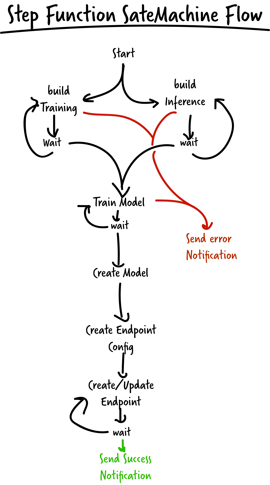
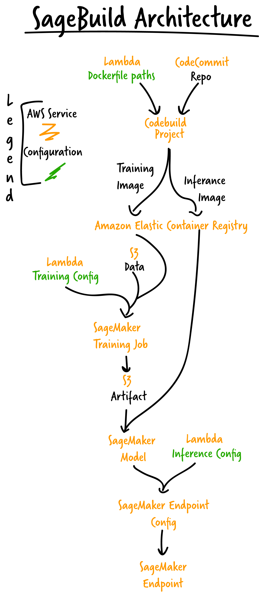

# AWS SageMaker Build
Automating the build and deployment of machine learning models is an important step in creating production machine learning services. Models need to be retrained and deployed when code and/or data are updated. This project provides a full implementation of a CI/CD workflow and includes jupyter notebooks showing how to create, launch, stop, and track the progress of builds using python and Amazon Alexa! The goal of aws-sagemaker-build is to provide a repository of common and useful SageMaker/Step Function pipelines, to be shared with the community and grown by the community.

## Prerequisites

- Run Linux. (tested on Amazon Linux)
- Install npm >5 and node >8. ([instructions](https://nodejs.org/en/download/))
- Clone this repo.
- Set up an AWS account. ([instructions](https://AWS.amazon.com/free/?sc_channel=PS&sc_campaign=acquisition_US&sc_publisher=google&sc_medium=cloud_computing_b&sc_content=AWS_account_bmm_control_q32016&sc_detail=%2BAWS%20%2Baccount&sc_category=cloud_computing&sc_segment=102882724242&sc_matchtype=b&sc_country=US&s_kwcid=AL!4422!3!102882724242!b!!g!!%2BAWS%20%2Baccount&ef_id=WS3s1AAAAJur-Oj2:20170825145941:s))
- Configure AWS CLI and a local credentials file. ([instructions](http://docs.AWS.amazon.com/cli/latest/userguide/cli-chap-welcome.html))  

## setup

1. install all need packages
```shell
npm install
```

2. create an s3 bucket. [instructions](https://docs.aws.amazon.com/AmazonS3/latest/dev/create-bucket-get-location-example.html). open up config.js and set templateBucket  and AssetBucket to the name of your s3 bucket.

3. launch stack
```shell
npm run up
```

## Stack Management
```shell
npm run up #launches stack
```
```shell
npm run update #updates the launched stack
```
```shell
npm run down #shuts down stack
```

template is written to /cloudformation/build/template.json

## Architecture

- The following diagram describes the flow of the Step Function StateMachine. There are several points where the StateMachine has to poll and wait for a task to complete.

- The following diagram shows how the services work together



